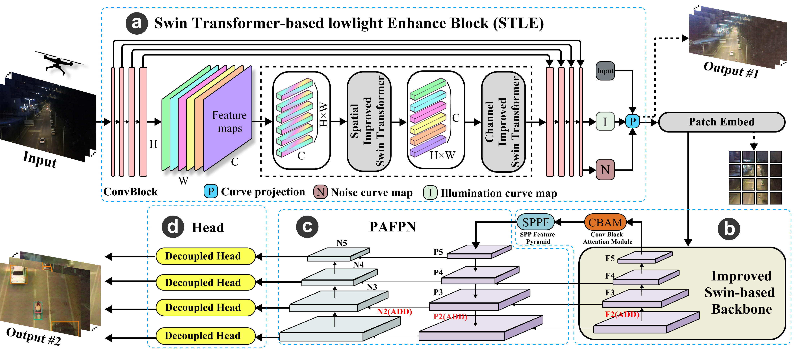

# SwinVision: detecting small objects in low-light environments
## Introduction


Neural networks have been widely used in the field of object detection. Transformers enable effective object detection through global context awareness, modular design, scalability, and adaptability to diverse target scales. However, small object detection requires careful consideration due to its complex computations, data requirements, and real-time performance challenges. We present SwinVision, an innovative framework for small object detection in low-light environments. We first introduce a Swin Transformer-based computing network optimized for real-time UAV monitoring in large areas. The framework strikes a balance between computational power and resource efficiency, surpassing conventional transformers. Then we present the STLE module, which enhances low-light image features for better object detection. Last is a specialized Swin-based detection block for accurate detection of small, detailed objects in resource-constrained scenarios.

## Install

```bash
# clone the SwinVision repository
git clone https://github.com/Leondav1s/SwinVision.git

# navigate to the cloned directory
# use ultralytics frame to 
cd SwinVision/ultralytics

# install the package in editable mode for development
pip install -e .
```

## Getting Started

**step1: use STLE to enhance your Images**

```bash
# firstly put your images into SwinVision/SwinVision/STLE/enhance_dataset
cd SwinVision/SwinVision/STLE

# the enhanced images will be saved to the 'result' folder
python enhance.py
```

**step2: use SOF detector to predict**

```bash
cd SwinVision/SwinVision/ultalytics

# remember change the source to your enhanced images result path
yolo detect predict model=SwinVision.pt source=../STLE/result/your/path
```

## Training

